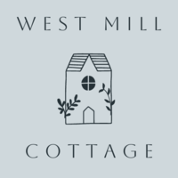
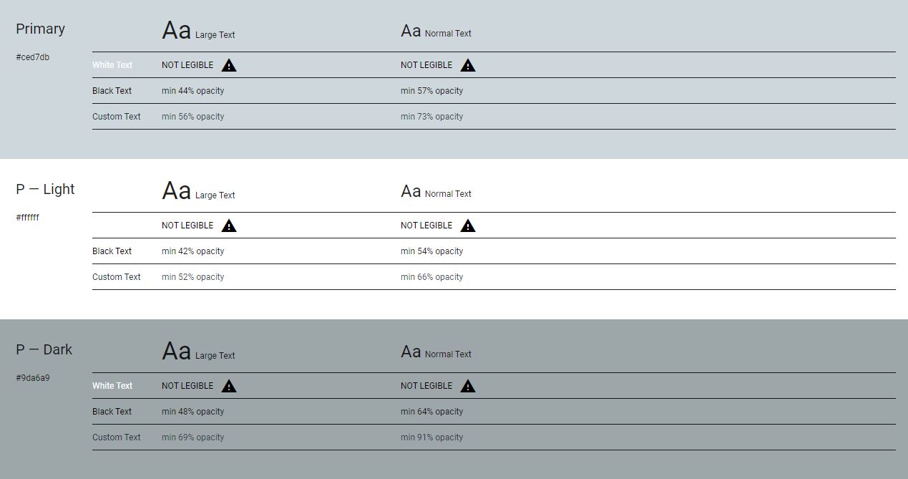
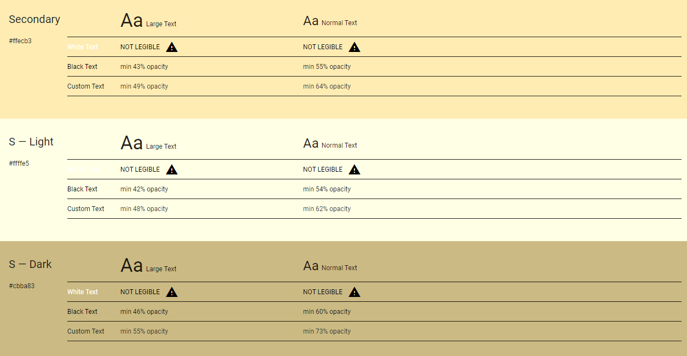

<h2 align="center"></h2  

# Website for: West Mill Cottage  

## Code Institute Milestone Project 1 – Static Front End Project  

*  West Mill Cottage is a blissfully tranquil riverside cottage set in rural countryside where England meets Scotland. The objective of the website is to appeal to prospective and returning tenants. The website is designed to be fully responsive so that the users experience is consistent across any device.   

* This website has been developed for the Milestone Project 1 submission as part of the Diploma in Web Application Development course facilitated by Code Institute and City of Bristol College.  

* This static front end website has been built using the different programming languages learned during the course, including HTML and CSS. The website has also utilised the Bootstrap framework technology.  

## Live Project  

## GitHub Repository  

# Contents  

- [User Experience](#user-experience)  

  * [User Stories](#user-stories)  

    + [Prospective tenants](#prospective-tenants)  

    + [Returning tenants](#returning-tenants)  

    + [Business owners](#business-owners)  

- [Design](#design)  

  + [Colour scheme](#colour-scheme)  

  + [Typography](#typography)  

  + [Imagery](#imagery)  

  + [Icons](#icons)  

- [Structure](#structure)  

  + [Information Architecture](#information-architecture)  

  + [Navigation Bar](#navigation-bar)  

  + [Back To Top Button](#back-to-top-button)  

  + [Buttons](#buttons)  

  + [Page Heading & Sub Navigations](#page-heading-and-sub-navigations)  

  + [Footer](#footer)  

# User Experience  

## User Stories  

### Prospective Tenants  

*The website users that fall into this category are considering visiting the area and are already looking for appropriate accommodation.*  

* As a prospective tenant, I would like to have an overview of the holiday cottage to determine if it is suitable for my requirements.  

*  As a prospective tenant, I would like to know the details of the holiday cottage including its attributes such as; number of bedrooms, bathrooms etc...  

* As a prospective tenant, I would like to know what activities and attractions are available in the local area.   

* As a prospective tenant, I would like to be able to contact the owners if I have any questions or special requests.  

### Returning Tenants  

*The website users that fall into this category are people or families that have previously stayed and enjoyed the holiday cottage and are looking to return.*  

* As a returning tenant, I would like to know if the holiday cottage has any new attributes, such as additional facilities etc...  

* As a returning tenant, I would like see genuine reviews from other people and families that have stayed at the holiday cottage.  

* As a returning tenant, I would like to know if there are any upcoming events in the local area that I could attend on my visit.  

* As a returning tenant, I would like to be able to let the owners know I am returning tenant so I can receive potential discounted rates.  

### Business Owners  

*The business owners are the owners of the holiday cottage and of the website*  

* As the business owner, I would like my website to be user friendly across all devices and accessible to visually impaired users.  

* As the business owner, I would like the website to promote the quality of the cottage and the activities and attractions in the local area.  

* As the business owner, I would like the website to emphasise the openness of us as owners and promote the asking of questions from users via the contact form and social media platforms.  

## Design  

### Colour Scheme  

#### Primary Colours
<h2 align="center"></h2>  

#### Secondary Colours
<h2 align="center"></h2>  

 - A simple colour scheme has been used with three primary colours and three secondary colours. The colours are all relatively light with dark type being used in contrast to give a refined and clean appearance.  

- This colour pallette has been chosen with the website imagery in mind. This is because the images are going to be what catch the user's attention.  

- I used the [Material Design Colour Tool](https://material.io/resources/color/#!/?view.left=0&view.right=0) to decide on colour choices.  

### Typography  

- Headings are in Aboreto and normal text is in Lato. Aboreto is a cursive font which is eyecathing and sophisticated which is in keeping with the style of the holiday cottage. Therefore cursive is the fallback font should Aboreto be unavailable. Lato is a clean and legible font which is commonly used for websites all over the world. Sans serif is the fallback font should Lato be unavailable.  

### Imagery  

- The images have been provided by the business owners and offer a genuine representation of the standard of the holiday cottage. The images are therefore a very important feature of the website as they must be of high quality to portray the holiday cottage in the same light.  

- Each of the pages uses different image layouts, this is due to the focus and purpose of each page being different e.g., carousel on the home page to give a taste and more focused images on the property details page e.g., kitchen, bathroom etc.  

- Most of the images are in landscape orientation and the use of the same aspect ratio for all images allows for a consistent user experience.  

### Icons  

- All icons were sourced from Font Awesome and have been used sparingly across each page to allow for a more focused approach to catch the users attention.  

## Structure  

### Website Architecture  

- This website has a home page and a further 5 pages, namely;    Property Details, Location, Activities, About and Contact.  

  - Home page – This is the landing page with a hero image and descriptions and navigation to the other pages.  

  - Property details - This page provides information about each room of the house which contains images and text.  

  - Location - This page provides information about where the holiday cottage is located, geographically and provides options on different modes of transport on how to get there.  

  - Activities - This page provides details on what activities are available to participate in within the local area of the holiday cottage.  

  - About - This page provides some brief and basic information from the owners of the holiday cottage to allow users to see the people behind the project.  

  - Contact - This page provides a contact form to allow users to contact the owners with questions regarding their potential stay or to enquire about returning as a tenant.  

  - Each page features a main ‘call to action’ which is achieved through a combination of images and buttons. The aim was to allow users to get to the information the page has to offer in as few steps as possible. 

 