# Testing

The website for West Mill Cottage has been tested using the following methods:
- [Code Validation](#code-validation)
    - [W3C HTML Validator](#w3c-html-validator)
        - [Home Page](#home-page)
        - [Property Details](#property-details-page)
        - [Location Page](#location-page)
        - [Activities Page](#activities-page)
        - [About Page](#about-page)
        - [Contact Page](#contact-page)
    - [W3C CSS Validator](#w3c-css-validator)
- [Chrome Dev Tools - Lighthouse](#chrome-dev-tools---lighthouse)

# Code Validation

## W3C HTML Validator

Each page of the West Mill Cottage website was subjected to the W3C HTML Validator tool, the results are evidenced below:

### Home Page
<h2 align="left">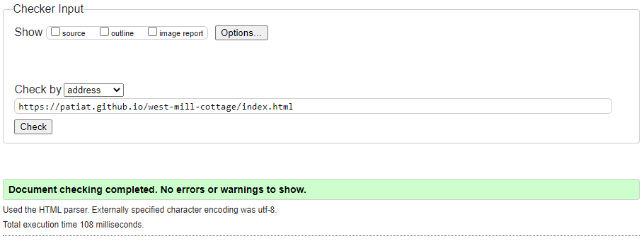</h2> 

### Property Details Page
<h2 align="left">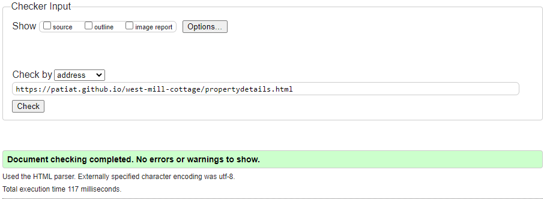</h2> 

### Location Page
<h2 align="left"></h2> 

### Activities Page
<h2 align="left">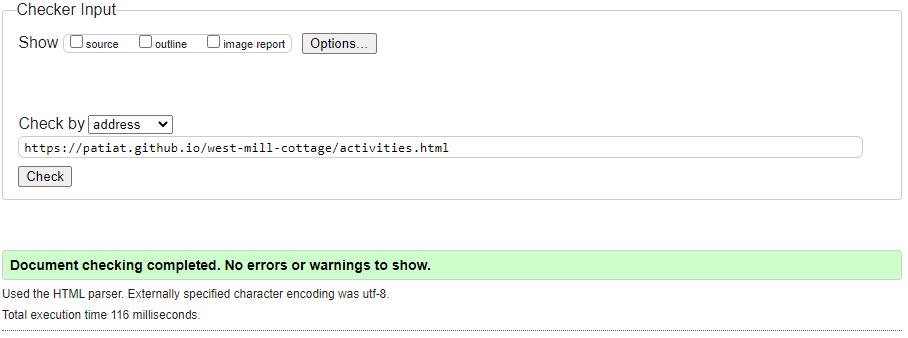</h2> 

### About Page
<h2 align="left">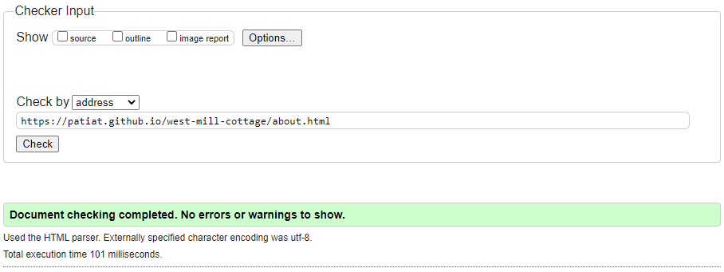</h2> 

### Contact Page
<h2 align="left">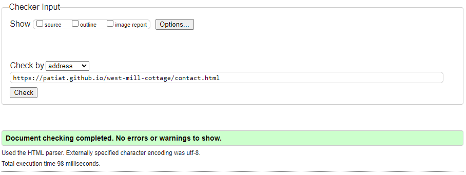</h2> 

## W3C CSS Validator

The West Mill Cottage website stylesheet was subjected to the W3C CSS Validator tool, the results are evidenced below:
<h2 align="left">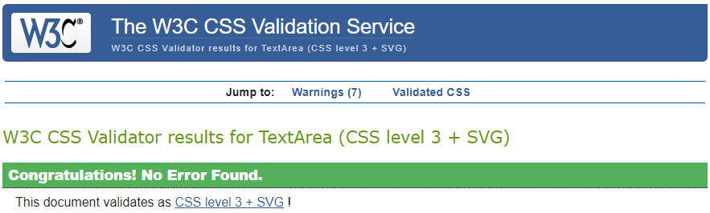</h2> 

# Chrome Dev Tools - Lighthouse

The chrome developer tool 'lighthouse' was used to assess the website for West Mill Cottage against the following parameters:
- Performance
- Accessibility
- Best Practices
- SEO (Search Engine Optimisation)

Each page was assessed in terms of desktop performance and mobile performance. Each page performed well and the results are evidenced below:

### Lighthouse report - Home Page
#### Desktop
<h2 align="left">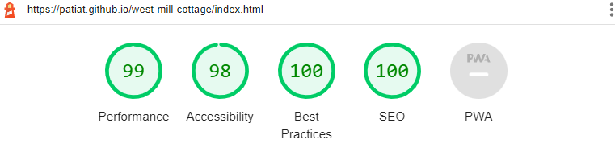</h2> 

#### Mobile
<h2 align="left">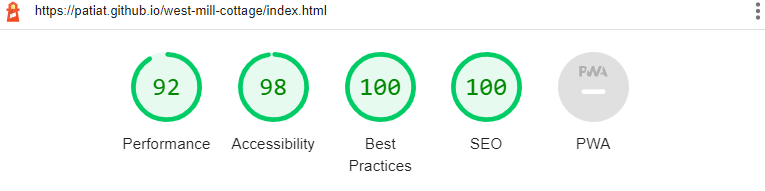</h2> 

### Lighthouse report - Property Details Page
#### Desktop
<h2 align="left">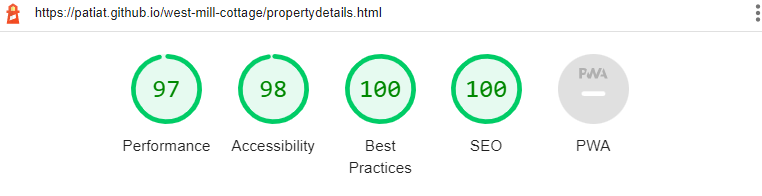</h2> 

#### Mobile
<h2 align="left">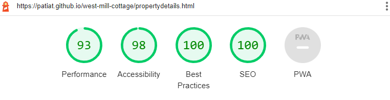</h2> 

### Lighthouse report - Location Page
#### Desktop
<h2 align="left">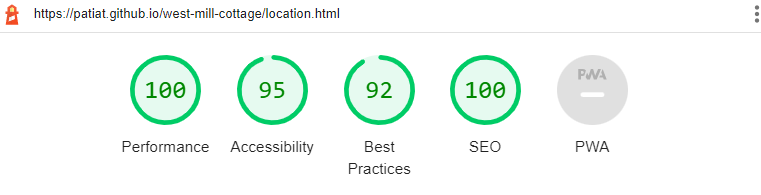</h2> 

#### Mobile
<h2 align="left">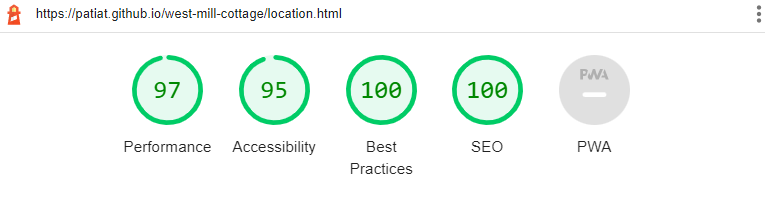</h2> 

### Lighthouse report - Activities Page
#### Desktop
<h2 align="left"></h2> 

#### Mobile
<h2 align="left">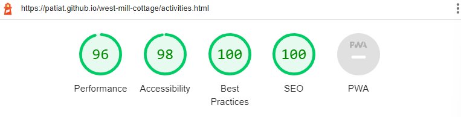</h2> 

### Lighthouse report - About Page
#### Desktop
<h2 align="left">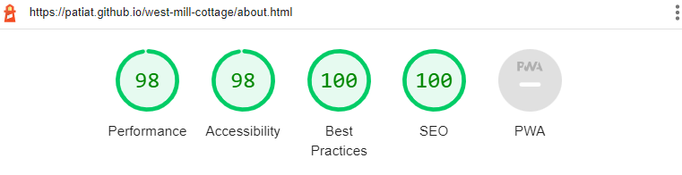</h2> 

#### Mobile
<h2 align="left">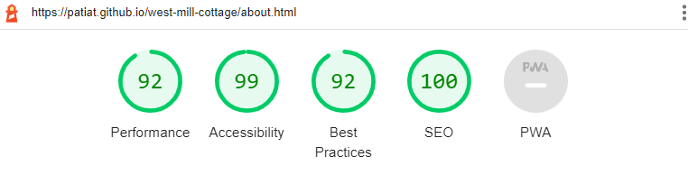</h2> 

### Lighthouse report - Contact Page
#### Desktop
<h2 align="left">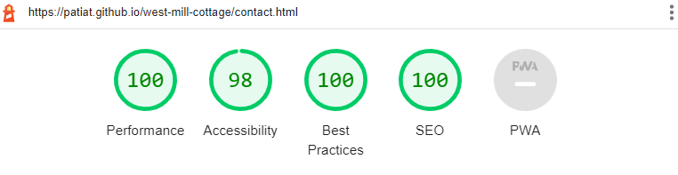</h2> 

#### Mobile
<h2 align="left">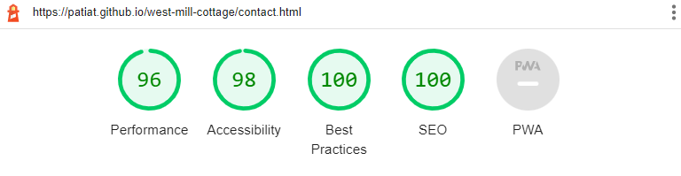</h2> 

The lighthouse reports made a number of recommendations which included:
- Serving images in next-gen formats such as WebP and AVIF to provide better compression. I decided not pursue this as these formats are not supported on all browsers at this time. Additionally, the user experience is not hugely affected by this.
- Some pages heading elements were not in a sequentially descending order. I decided to amend the code to ensure compliance with this recommendation and to ensure that a fully semantic structure was adpoted to make it easier for assistive navigation technologies.

# A11y Color Contrast Accessibility Checker

All website pages were tested using the A11y Color Contrast Accessibility Checker, the results are evidenced below:

### Home Page
<h2 align="left">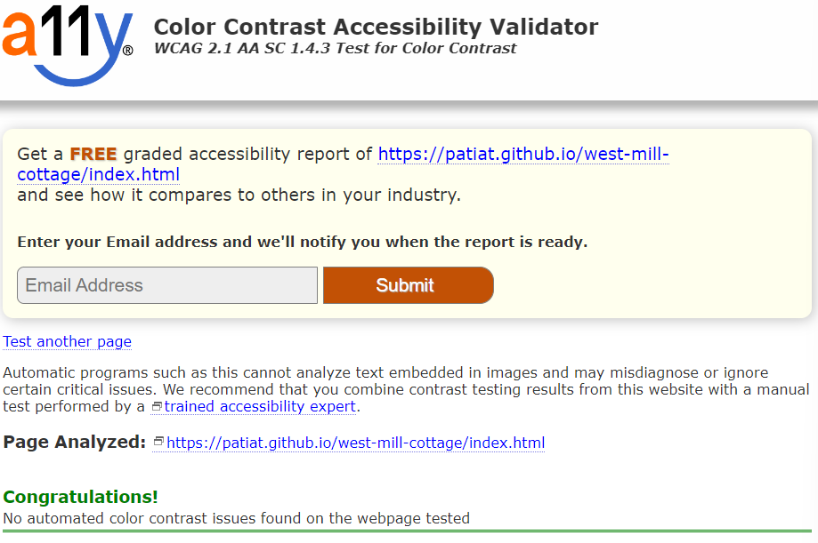</h2> 

### Property Details Page
<h2 align="left">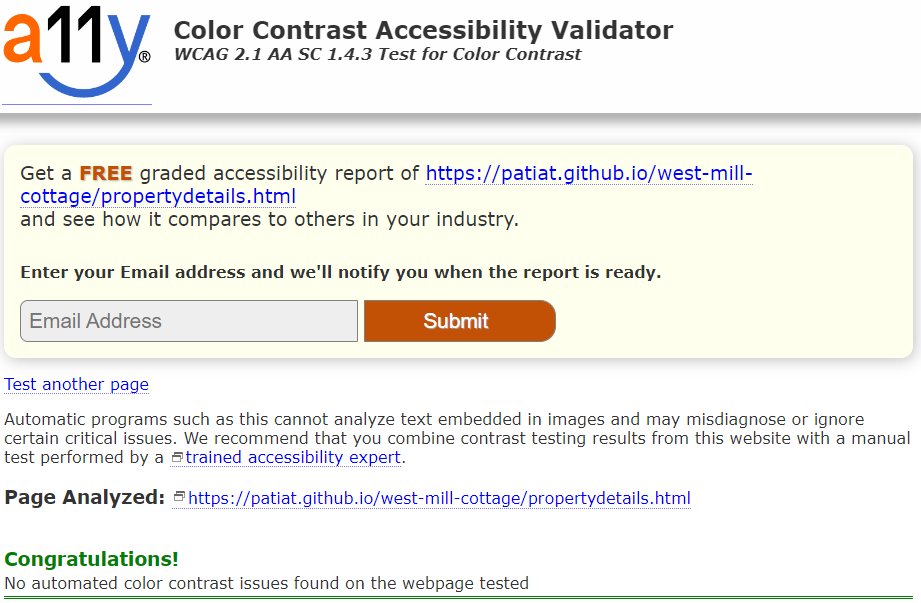</h2> 

### Location Page
<h2 align="left"></h2> 

### Activities Page
<h2 align="left"></h2> 

### About Page
<h2 align="left"></h2> 

### Contact Page
<h2 align="left">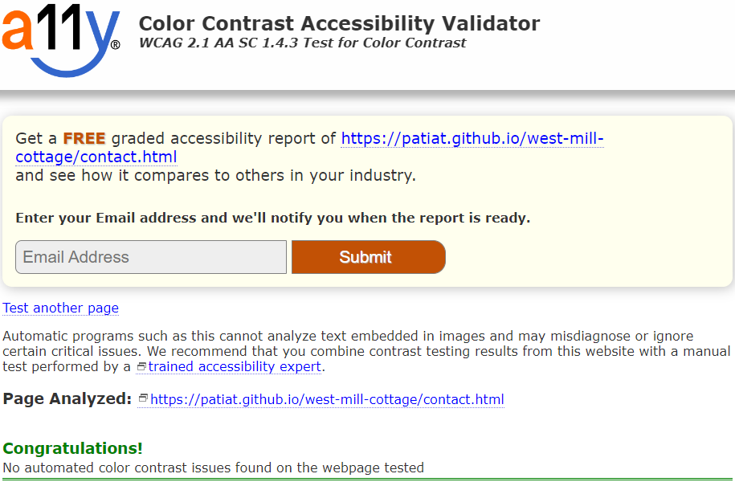</h2> 

# Browser Compatibility

On desktop, the site was tested in the following browsers:
- Chrome
- Edge
- Firefox
- Safari

No issues were identified with appearance, responsiveness or functionality during usage of the website on these browsers.

On mobile and tablet, the site was tested in the following browsers:
- Chrome
- Safari
- Firefox

No issues were identified with appearance, responsiveness or functionality during usage of the website on these browsers.

# Responsiveness

Responsiveness assessments were undertaken using the Chrome Developer Tools across a number of screen sizes including: 
- iPhone SE
- iPhone XR
- iPhone 12 Pro
- Pixel 5
- Samsung Galaxy S8+
- Samsung Galaxy S20 Ultra
- iPad Mini
- iPad Air
- Surface Pro 7
- Surface Duo
- Galaxy Fold
- Samsung Galaxy A51/71
- Nest Hub
- Nest Hub Max

No issues were identified with appearance, responsiveness or functionality during usage of the website on these virtual screen sizes.

The website was also testing on actual hardware including:
- iPhone 13 Pro
- iPhone 11
- iPhone 6
- MacBook Air 2015
- HP All in One Desktop 27
- iPad 2021

# Mentor

## Assistance

- I made site live on GitHub pages early on in the development process to test on real hardware iPhone 13 PRO and iPhone 11, Mac Book Air 2015 and HP Desktop 27in.
- Word separation of image file names were highlighted as not being consistent so files were renamed with underscores for a more consistent approach.
- Contact page: Although required fields are identified via an * there is no narrative to explicitly state that fields marked with * must be completed. Therefore, a narrative was put in place above the contact form.

# Bugs

## Resolved
- Heading elements were not in a sequentially descending order. Some blocks of code had `h5` elements as the first heading. Each page was assessed for `h5` elements and amended to `h1`. Some of the CSS required amendments to maintain the style of the website e.g., size and fonts.
- The Google Maps iFrame did not have a title. This would have impacted on the user experience of impaired users. Therefore, the code was amended and a title attribute added to the Google iFrame element.

## Unresolved
- Chrome Lighthouse suggestions including:
    - Serve images in next-gen formats (Image formats like WebP and AVIF often provide better compression than PNG or JPEG, which means faster downloads and less data consumption).
    - Eliminate render-blocking resources (Resources are blocking the first paint of your page. Consider delivering critical JS/CSS inline and deferring all non-critical JS/styles).
    - Serve static assets with an efficient cache policy (A long cache lifetime can speed up repeat visits to your page).