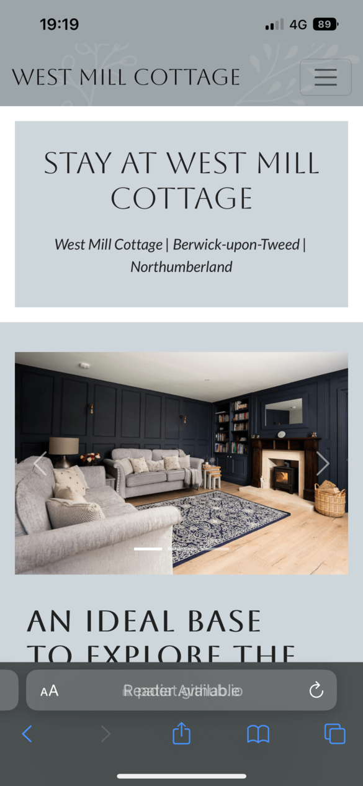
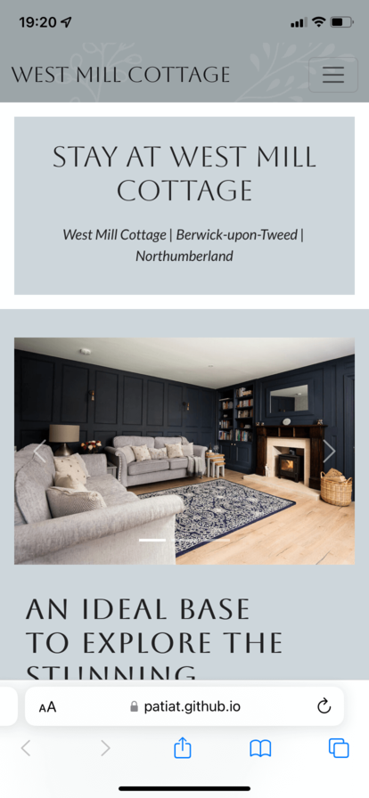
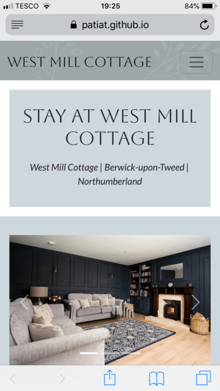
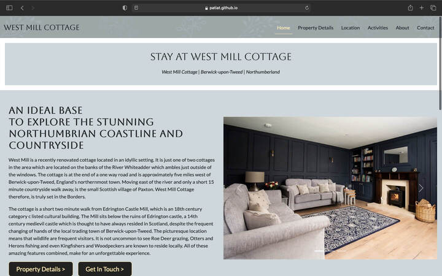
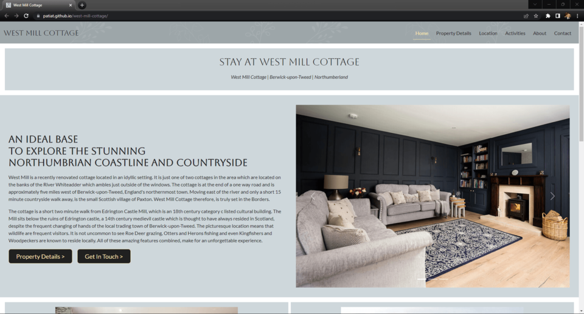
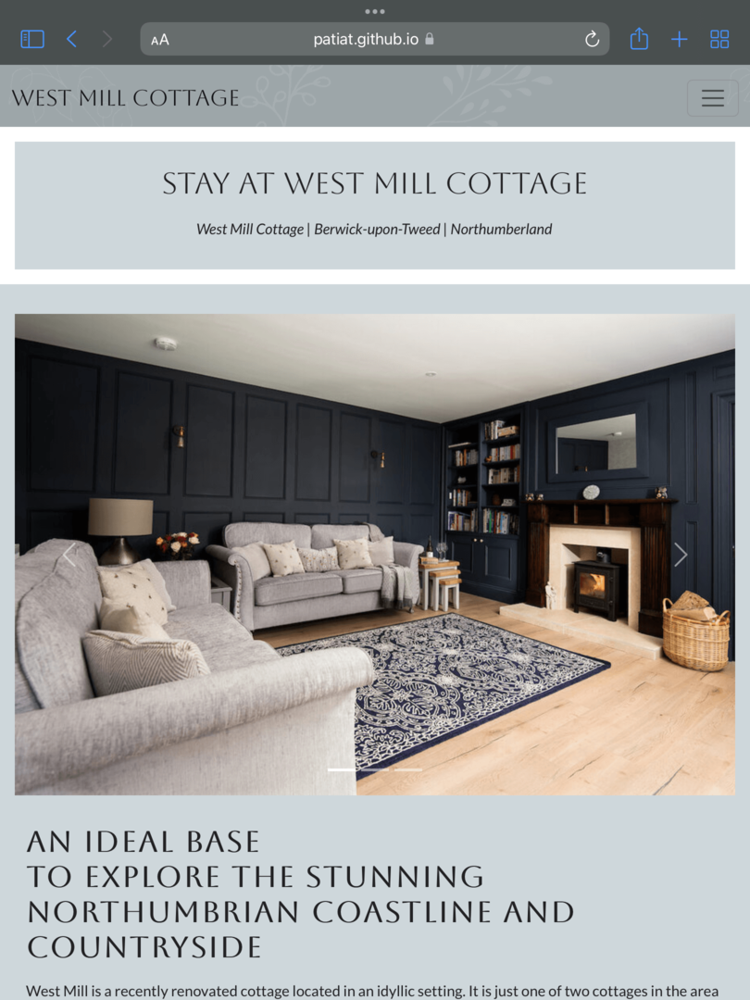

# Testing

The website for West Mill Cottage has been tested using the following methods:
- [Code Validation](#code-validation)
    - [W3C HTML Validator](#w3c-html-validator)
        - [Home Page](#home-page)
        - [Property Details](#property-details-page)
        - [Location Page](#location-page)
        - [Activities Page](#activities-page)
        - [About Page](#about-page)
        - [Contact Page](#contact-page)
    - [W3C CSS Validator](#w3c-css-validator)

- [Chrome Dev Tools - Lighthouse](#chrome-dev-tools---lighthouse)

- [A11y Color Contrast Accessibility Checker](#a11y-color-contrast-accessibility-checker)

- [Browser Compatibility](#browser-compatibility)

- [Responsiveness](#responsiveness)

- [Testing User Stories](#testing-user-stories)
    - [Prospective Tenants](#prospective-tenants)
    - [Returning Tenants](#returning-tenants)
    - [Business Owners](#business-owners)

- [Peer Review](#peer-review)
    - [Slack](#slack)
    - [Google Forms](#google-forms)

- [Mentor](#mentor)
    - [Assistance](#assistance)

- [Bugs](#bugs)
    - [Resolved](#resolved)
    - [Unresolved](#unresolved)
    - [Opportunities for future performance enhancement](#opportunities-for-future-performance-enhancement)

# Code Validation

## W3C HTML Validator

Each page of the West Mill Cottage website was subjected to the W3C HTML Validator tool, the results are evidenced below:

### Home Page
<h2 align="left"></h2> 

### Property Details Page
<h2 align="left"></h2> 

### Location Page
<h2 align="left"></h2> 

### Activities Page
<h2 align="left"></h2> 

### About Page
<h2 align="left"></h2> 

### Contact Page
<h2 align="left"></h2> 

## W3C CSS Validator

The West Mill Cottage website stylesheet was subjected to the W3C CSS Validator tool, the results are evidenced below:
<h2 align="left"></h2> 

# Chrome Dev Tools - Lighthouse

The chrome developer tool 'lighthouse' was used to assess the website for West Mill Cottage against the following parameters:
- Performance
- Accessibility
- Best Practices
- SEO (Search Engine Optimisation)

Each page was assessed in terms of desktop performance and mobile performance. Each page performed well and the results are evidenced below:

### Lighthouse report - Home Page
#### Desktop
<h2 align="left"></h2> 

#### Mobile
<h2 align="left"></h2> 

### Lighthouse report - Property Details Page
#### Desktop
<h2 align="left"></h2> 

#### Mobile
<h2 align="left"></h2> 

### Lighthouse report - Location Page
#### Desktop
<h2 align="left"></h2> 

#### Mobile
<h2 align="left"></h2> 

### Lighthouse report - Activities Page
#### Desktop
<h2 align="left"></h2> 

#### Mobile
<h2 align="left"></h2> 

### Lighthouse report - About Page
#### Desktop
<h2 align="left"></h2> 

#### Mobile
<h2 align="left"></h2> 

### Lighthouse report - Contact Page
#### Desktop
<h2 align="left"></h2> 

#### Mobile
<h2 align="left"></h2> 

The lighthouse reports made a number of recommendations which included:
- Serving images in next-gen formats such as WebP and AVIF to provide better compression. I decided not pursue this as these formats are not supported on all browsers at this time. Additionally, the user experience is not hugely affected by this.
- Some pages heading elements were not in a sequentially descending order. I decided to amend the code to ensure compliance with this recommendation and to ensure that a fully semantic structure was adpoted to make it easier for assistive navigation technologies.

# A11y Color Contrast Accessibility Checker

All website pages were tested using the A11y Color Contrast Accessibility Checker, the results are evidenced below:

### Home Page
<h2 align="left"></h2> 

### Property Details Page
<h2 align="left"></h2> 

### Location Page
<h2 align="left"></h2> 

### Activities Page
<h2 align="left"></h2> 

### About Page
<h2 align="left"></h2> 

### Contact Page
<h2 align="left"></h2> 

# Browser Compatibility

On desktop, the site was tested in the following browsers:
- Chrome
- Edge
- Firefox
- Safari

No issues were identified with appearance, responsiveness or functionality during usage of the website on these browsers.

On mobile and tablet, the site was tested in the following browsers:
- Chrome
- Safari
- Firefox

No issues were identified with appearance, responsiveness or functionality during usage of the website on these browsers.

# Responsiveness

Responsiveness assessments were undertaken using the Chrome Developer Tools across a number of screen sizes including: 
- iPhone SE
- iPhone XR
- iPhone 12 Pro
- Pixel 5
- Samsung Galaxy S8+
- Samsung Galaxy S20 Ultra
- iPad Mini
- iPad Air
- Surface Pro 7
- Surface Duo
- Galaxy Fold
- Samsung Galaxy A51/71
- Nest Hub
- Nest Hub Max

No issues were identified with appearance, responsiveness or functionality during usage of the website on these virtual screen sizes.

The website was also testing on actual hardware including:
- iPhone 13 Pro
<h2 align="left"></h2> 
- iPhone 11
<h2 align="left"></h2> 
- iPhone 6
<h2 align="left"></h2> 
- MacBook Air 2015
<h2 align="left"></h2> 
- HP All in One Desktop 27
<h2 align="left"></h2> 
- iPad 2021
<h2 align="left"></h2> 

# Testing User Stories  

## Prospective Tenants  

* As a prospective tenant, I would like to have an overview of the holiday cottage to determine if it is suitable for my requirements.  

  - The home page has a carousel which demonstrates the standard of the rooms in the cottage. Additionally, the property overview page has detailed information on the holiday cottage and amenities.

* As a prospective tenant, I would like to know the details of the holiday cottage including its attributes such as; number of bedrooms, bathrooms etc...

  - The property details page contains detailed information on each of the rooms and other attributes of the property.

* As a prospective tenant, I would like to know what activities and attractions are available in the local area.

  - The activities page contains detailed information and links to external websites which contain further information on activities that are available to do locally.   

* As a prospective tenant, I would like to be able to contact the owners if I have any questions or special requests.  

  - There is a form on the contact page where users can contact the owners with any special requests they may have.

## Returning Tenants  

* As a returning tenant, I would like to know if the holiday cottage has any new attributes, such as additional facilities etc...  

  - The information on the property details page can be updated as necessary when updates or new features are made available.

* As a returning tenant, I would like see genuine reviews from other people and families that have stayed at the holiday cottage.

  - Although this is thought to be a useful feature of a website of this type, it is beyond the scope of this project and this user story has therefore been added to the list of potential future features.

* As a returning tenant, I would like to know if there are any upcoming events in the local area that I could attend on my visit.  

  - The activities page can facilitate this requirement because the page contains links to local organisation websites that promote local events.

* As a returning tenant, I would like to be able to let the owners know I am returning tenant so I can receive potential discounted rates.  

  - The form on the contact page can be used to advise the owners if tenants are returning or are first time visitors.

## Business Owners  

* As the business owner, I would like my website to be user friendly across all devices and accessible to visually impaired users.

  - The website is fully responsive on all device screen sizes and maintains the desired styles throughout. Additionally it is written in semantic code for accessibility. The website also contains meta descriptions and keywords to improve search engine optimisation.

* As the business owner, I would like the website to promote the quality of the cottage and the activities and attractions in the local area.  
  
  - The website connects with the style of the holiday cottage. The colour pallete, typography and styling all fit with the style and decor or the holiday cottage itself.

* As the business owner, I would like the website to emphasise the openness of us as owners and promote the asking of questions from users via the contact form and social media platforms.

  - This is acheived by the showcasing of the property through the images and content. Additionally, the presence of a form allowing users to ask anything also displays the openness of the owners.

# Peer Review

## Slack

- In the last stages of development and testing, I submitted my project for review to fellow students at Code Institute. This was facilitated via the peer code review on Slack. Feedback included:
  - *I’ve had a cursory look at the website, accessed all of the navbar, and links to external sites/socials. For what its worth (I’m just a student on here) it is a great website! Aesthetically, super clean and consistent. All the functionality is there and the user experience is made easy. I tested it on my Mac (large screen) and it worked fine.*

## Google Forms

- A form was created using Google Forms and was distributed to the business owners, family and close friends for their feedback. Feedback included:
  - *Looks great. Easy to use.*
  - *Stunning looking website. Well designed, very easy to navigate and it looks classy.*
  - *Brilliant website, very informative and easy to use.*
  - *It's excellent.*

- [You can view the peer review form responses in PDF format here.](https://github.com/PATIAT/west-mill-cottage/blob/main/assets/form-responses/west-mill-cottage-peer-review-form-responses.pdf) 
  
# Mentor

## Assistance

- I made site live on GitHub pages early on in the development process to test on real hardware iPhone 13 PRO and iPhone 11, Mac Book Air 2015 and HP Desktop 27in.
- Word separation of image file names were highlighted as not being consistent so files were renamed with underscores for a more consistent approach.
- Contact page: Although required fields are identified via an * there is no narrative to explicitly state that fields marked with * must be completed. Therefore, a narrative was put in place above the contact form.
- Following a pre-project submission meeting with my Tutor regarding the site layout on large screens and potentially reconfiguring the code to include a margin on the left and right to improve flow and appearance on very large screens, I have decided against making these changes at this late stage of the project. This was also discussed with my CI mentor who advised that this can lead to display scaling issues on 2k or 4k displays where the content can appear very small and not as intended. This concept will be considered when planning any future projects as it is a commonly adopted practise which can be demonstrated by visiting websites such as [apple](https://www.apple.com/uk/).
- Following a pre-project submission meeting with my Tutor regarding the about page content, it was advised that I change the text from centre align to left align for improved readability. This advice was adopted.

# Bugs

## Resolved
- Heading elements were not in a sequentially descending order. Some blocks of code had `h5` elements as the first heading. Each page was assessed for `h5` elements and amended to `h1`. Some of the CSS required amendments to maintain the style of the website e.g., size and fonts.
- The Google Maps iFrame did not have a title. This would have impacted on the user experience of impaired users. Therefore, the code was amended and a title attribute added to the Google iFrame element.
- Whilst manually testing the website (contact page), I noticed that when completing the form and submitting it, although the form is set up sucessfully and I was receiving the success message from code institute, the input name and value were not pulling through correctly. Upon inspection of the code, I discovered that I had omitted the name attribute from the label and input elements. This was resolved at the time of discovery.

## Unesolved
- None.

## Opportunities for future performance enhancement
- Chrome Lighthouse suggestions including:
    - Serve images in next-gen formats (Image formats like WebP and AVIF often provide better compression than PNG or JPEG, which means faster downloads and less data consumption).
    - Eliminate render-blocking resources (Resources are blocking the first paint of your page. Consider delivering critical JS/CSS inline and deferring all non-critical JS/styles).
    - Serve static assets with an efficient cache policy (A long cache lifetime can speed up repeat visits to your page).